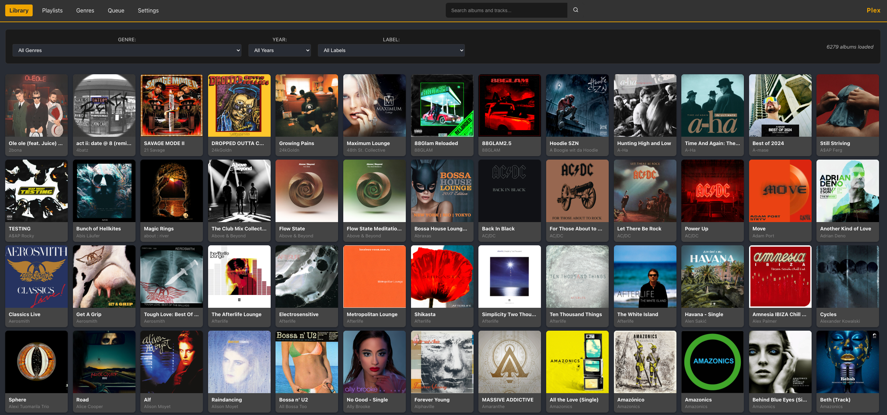
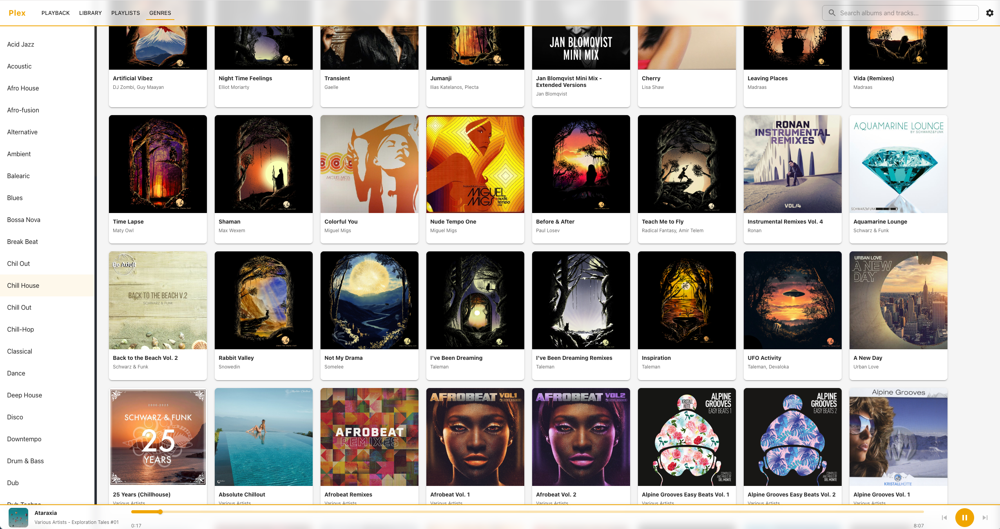

# Plex Web Client

A React-based web client for streaming music from your local Plex Media Server. Browse your music library, manage playlists, explore genres, and enjoy seamless audio playback with an intuitive interface.

Dark theme:


Light theme


## Features

- **Music Library Browsing**: Browse your entire music collection with pagination and filtering
- **Playlists**: Access and play your Plex playlists
- **Genres**: Explore music by genre
- **Search**: Quick search across your music library
- **Queue Management**: Build and manage your playback queue
- **Audio Player**: Full-featured audio player with play/pause, next/previous controls
- **Keyboard Shortcuts**: Spacebar to play/pause, Shift+Arrow keys for navigation
- **Settings**: Customize album card sizes and other preferences
- **Cache Management**: Efficient caching of Plex API responses

## Prerequisites

- Node.js (v14 or higher recommended)
- npm or yarn
- A Plex Media Server with a music library (from local NAS for example)
- Access to your Plex server (local network or remote)

## Installation

1. Clone the repository:
```bash
git clone <repository-url>
cd plex.org
```

2. Install dependencies:
```bash
npm install
```

3. Set up environment variables (see [Environment Setup](#environment-setup) below)

4. Start the development server:
```bash
npm start
```

The app will open at [http://localhost:3000](http://localhost:3000)

## Environment Setup

This application requires environment variables to connect to your Plex Media Server. Create a `.env` file in the root directory of the project.

### Creating the .env File

1. Create a new file named `.env` in the project root directory
2. Add the following variables:

```env
REACT_APP_PLEX_URL=http://your-plex-server-ip:32400
REACT_APP_PLEX_TOKEN=your-plex-token-here
```

**Important**:
- Never commit the `.env` file to version control
- The `.env` file should already be in `.gitignore`
- Restart the development server after creating or modifying the `.env` file

### Finding Your Plex Server URL

The Plex server URL format is: `http://<SERVER_IP>:32400`

**For local network access:**
1. Find your Plex server's local IP address:
   - On Windows: Open Command Prompt and run `ipconfig`
   - On macOS/Linux: Open Terminal and run `ifconfig` or `ip addr`
   - Look for your local network IP (typically starts with 192.168.x.x or 10.x.x.x)
2. Use the format: `http://192.168.1.100:32400` (replace with your actual IP)

**For remote access:**
- Use your Plex remote access URL if configured
- Format: `https://your-plex-server.plex.direct:32400` or your custom domain

### Finding Your Plex Server Token

The Plex token is required for API authentication. Here are several methods to obtain it:

#### Method 1: Using Browser Developer Tools (Recommended)

1. Open your Plex Web App in a browser (e.g., `http://localhost:32400/web` or your remote URL)
2. Sign in to your Plex account
3. Open Developer Tools (F12 or Right-click → Inspect)
4. Go to the **Network** tab
5. Browse to any library item (e.g., click on an album or track)
6. Look for any API request in the Network tab
7. Click on a request and check the **Request Headers** or **URL parameters**
8. Find the `X-Plex-Token` parameter - this is your token

#### Method 2: Using Plex Web App URL

1. Sign in to your Plex Web App
2. Browse to any library item
3. Click the three dots (`...`) next to an item
4. Select "Get Info"
5. In the Media Info window, click "View XML"
6. Look at the URL in your browser's address bar
7. Find the `X-Plex-Token` parameter in the URL - this is your token

#### Method 3: Using Plex API Directly

1. Sign in to your Plex Web App
2. Open Developer Tools (F12)
3. Go to the **Console** tab
4. Run this command:
```javascript
window.localStorage.getItem('myPlexAccessToken')
```
5. The returned value is your Plex token

#### Method 4: Using Plex Settings

1. Sign in to your Plex Web App
2. Go to Settings → Network
3. Check the "Show Advanced" option
4. Look for authentication tokens in the network settings

**Example .env file:**
```env
REACT_APP_PLEX_URL=http://192.168.1.100:32400
REACT_APP_PLEX_TOKEN=abc123xyz789token456
```

## Available Scripts

In the project directory, you can run:

### `npm start`

Runs the app in development mode.\
Open [http://localhost:3000](http://localhost:3000) to view it in your browser.

The page will reload when you make changes.\
You may also see any lint errors in the console.

### `npm test`

Launches the test runner in interactive watch mode.\
See the section about [running tests](https://facebook.github.io/create-react-app/docs/running-tests) for more information.

### `npm run build`

Builds the app for production to the `build` folder.\
It correctly bundles React in production mode and optimizes the build for the best performance.

The build is minified and the filenames include the hashes.\
Your app is ready to be deployed!

See the section about [deployment](https://facebook.github.io/create-react-app/docs/deployment) for more information.

### `npm run eject`

**Note: this is a one-way operation. Once you `eject`, you can't go back!**

If you aren't satisfied with the build tool and configuration choices, you can `eject` at any time. This command will remove the single build dependency from your project.

Instead, it will copy all the configuration files and the transitive dependencies (webpack, Babel, ESLint, etc) right into your project so you have full control over them. All of the commands except `eject` will still work, but they will point to the copied scripts so you can tweak them. At this point you're on your own.

You don't have to ever use `eject`. The curated feature set is suitable for small and middle deployments, and you shouldn't feel obligated to use this feature. However we understand that this tool wouldn't be useful if you couldn't customize it when you are ready for it.

## Keyboard Shortcuts

- **Spacebar**: Play/Pause current track
- **Shift + Right Arrow**: Play next track
- **Shift + Left Arrow**: Play previous track

## Troubleshooting

### App shows "Please create a .env file" alert

- Ensure you've created a `.env` file in the project root
- Verify the environment variable names are correct: `REACT_APP_PLEX_URL` and `REACT_APP_PLEX_TOKEN`
- Make sure there are no extra spaces around the `=` sign
- Restart the development server after creating/modifying the `.env` file

### Cannot connect to Plex server

- Verify your Plex server is running and accessible
- Check that the `REACT_APP_PLEX_URL` is correct (including the port `:32400`)
- Ensure your Plex token is valid and not expired
- Check your network connection and firewall settings
- For local access, ensure you're on the same network as your Plex server

### CORS errors in browser console

- Plex servers may have CORS restrictions
- Ensure you're accessing the app from an allowed origin
- Check Plex server network settings for allowed origins

## Learn More

- [Create React App documentation](https://facebook.github.io/create-react-app/docs/getting-started)
- [React documentation](https://reactjs.org/)
- [Plex API documentation](https://www.plex.tv/api/)

## License

This project is private and proprietary.
